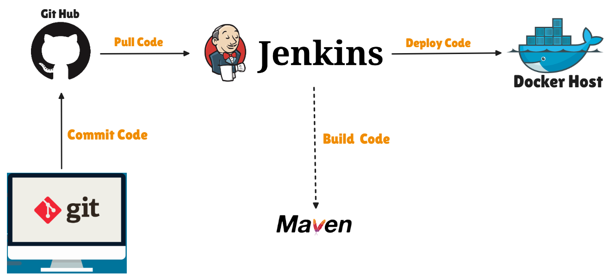

# 🚀 Automated CI/CD Pipeline Using Jenkins, Maven, and Docker 🌟

## 🔄 CI/CD Workflow – How It Works

- Developer writes code on local system and commits it using Git. 💻  
- Code is pushed to the GitHub repository. 📦  
- Jenkins automatically pulls the latest code from GitHub. 🔄  
- Jenkins uses Maven to build the application. 🛠️  
- After a successful build, Jenkins creates a Docker image. 🐳  
- The Docker image is deployed and runs as a container on the Docker Host. 🚀  
- Every new code change triggers this pipeline automatically. ⚡
## 🔹 1️⃣  INSTALL AND CONFIGURE JENKINS 🔹
**` Go to Aws `**
  👉 EC2 ➡️ Launch Instance ➡️ Name = [JENKINS-SERVER] ➡️ AMI=Amazon Linux(QuickStart) ➡️ Amazon.Linux 2 AMI(HVM)-Kernel 5.10 , SSD Volume Type (Free Tier Eligible) ➡️ Architecture = 64-bit(x86) ➡️ Instance type = t2.micro(Free Tier Eligible) ➡️ Key pair = Createnewone ➡️ Network Settings = Firewall = create security group = ✔️ Allow SSH traffic from 0.0.0.0/0 ➡️ Configure storage = 1x8 GiB gp2 Root Volume = Launch Instance = copy public IPV4 address
  **` Go to MobaXtrem `**
  👉 Session ➡️ SSH ➡️ Remote host (Paste here IPV4) ➡️ ✔️specify username = ec2-user , Port 22 
  Advanced SSH Settings = ✔️ use private key = ______(Provide private key which is in downloads) ➡️ ✔️x11 = Forwarding ➡️ ✔️Compression ➡️ Remote environment = interactive shell ➡️ SSH-browser-type = SFTP protocol = OK 
  **` Go to Terminal `**
- 👉`[ec2-user@ip-172-31-47-91 ~]$ sudo su `
- 👉`[root@ip-172-31-47-91 ec2-user]# cd ~`
- 🔗 https://www.jenkins.io/doc/tutorials/tutorial-for-installing-jenkins-on-AWS/ (for reference use this link)
- Updates all installed packages to the latest version. It may not remove old packages.
  👉`[root@ip-172-31-47-91 ~]# sudo yum update -y `
- This is used to add the Jenkins repo to our system
  👉`[root@ip-172-31-47-91 ~]# sudo wget -O /etc/yum.repos.d/jenkins.repo \  https://pkg.jenkins.io/redhat-stable/jenkins.repo`
- This command tells your system to trust Jenkins packages so you can install them safely.
  👉`[root@ip-172-31-47-91 ~]# sudo rpm --import https://pkg.jenkins.io/redhat-stable/jenkins.io-2023.key`
- Updates all installed packages to the latest version and can remove obsolete packages if needed.
  👉`[root@ip-172-31-47-91 ~]# sudo yum upgrade`
- Amazon Linux has only basic software,so adding EPEL repo lets U easily install extra useful packages like htop, nginx, and dev tools using yum.
- EPEL =  Extra Packages for Enterprise Linux
  👉`[root@ip-172-31-47-91 ~]# amazon-linux-extras install epel`
- “Install Java 11 on Amazon Linux automatically without asking me questions.”
  👉`[root@ip-172-31-47-91 ~]# sudo amazon-linux-extras install java-openjdk11 -y`
- “Install Amazon’s Java 11 automatically on my system.”
  👉`[root@ip-172-31-47-91 ~]# yum install java-11-amazon-corretto -y`
- “Install Jenkins automatically on my system without asking me any questions.”
  👉`[root@ip-172-31-47-91 ~]# yum install jenkins -y`
- “Make Jenkins start automatically whenever my system turns on.”
  👉`[root@ip-172-31-47-91 ~]# sudo systemctl enable jenkins`
- “Turn on Jenkins right now so I can use it.”
  👉`[root@ip-172-31-47-91 ~]# sudo systemctl start jenkins`
- Shows which version of Java is installed and running on your system. `java --version`
- Shows which version of Java compiler is installed. `javac --version`
  👉`[root@ip-172-31-47-91 ~]# systemctl status jenkins`
### CHANGING HOSTNAME OF THE SERVER
👉`[root@ip-172-31-47-91 ~]# hostname JENKINS-SERVER` &nbsp;&nbsp;&nbsp;&nbsp;&nbsp;&nbsp;&nbsp;&nbsp;   [meaning = “Rename my server to JENKINS-SERVER.”]
  👉`[root@ip-172-31-47-91 ~]# cd /etc`
  👉`[root@ip-172-31-47-91 etc]# vim hostname` &nbsp;&nbsp;&nbsp;&nbsp; [ Inside file remove everything just write `JENKINS-SERVER` & :wq ]
  👉`[root@ip-172-31-47-91 etc]# init 6` &nbsp;&nbsp;`[Press R]` &nbsp;&nbsp;&nbsp;&nbsp;[ This cmd is to reboot server ]
### JENKINS WORKS ON PORT 8080
**` Go to Aws `** ➡️EC2➡️ security ➡️ securitygroups ➡️ Inbound rules ➡️ Edit Inbound Rules➡️ Add rule ➡️ portrange=8080 ➡️ source=AnywhereIPV4 ➡️ Type=customTCP ➡️ SaveRules
### JENKINS INSTALLATION
Copy public IPV4 Address ,paste in browser➡️ 172-31-47-91:8080 ➡️ copy path of password shown  
**Go to terminal**   👉`[ec2-user@JENKINS-SERVER ~]$ sudo su`
  👉`[root@JENKINS-SERVER ec2-user]# cat ______paste the path of password` 
 **Go to JENKINS GUI**  Install suggested plugins ➡️ username _____  ➡️ Password ______  ➡️ Fullname ______  ➡️ Save & Continue ➡️ Start using Jenkins
  😏So here we completed Jenkins setup on EC2 Instance & on the same server we will be configuring the maven also in next step.
## 🔹 2️⃣ INSTALL AND CONFIGURE THE MAVEN 🔹
🔗 https://maven.apache.org/download.cgi ➡️ Binary tar.gz archive = 🔗apache-maven-3.9.12-bin.tar.gz = Right click = Copy link address
  👉`[ec2-user@JENKINS-SERVER ~]$ sudo su`
  👉`[root@JENKINS-SERVER ec2-user]# cd ~`
  👉`[root@JENKINS-SERVER ~]# cd /opt`
  👉`[root@JENKINS-SERVER opt]#  wget _____paste here the copied path`
  👉`[root@JENKINS-SERVER opt]# ls`
  O/P = apache-maven-3.9.3-bin.tar.gz(This is now downloaded file)&nbsp;&nbsp;&nbsp;&nbsp;&nbsp;&nbsp;aws &nbsp;&nbsp;&nbsp;&nbsp;&nbsp;&nbsp;rh
  👉`[root@JENKINS-SERVER opt]# tar -xzvf apache-maven-3.9.3-bin.tar.gz` &nbsp;&nbsp;(This is to exctract the file)
  👉`[root@JENKINS-SERVER opt]# ls`
  O/P = apache-maven-3.9.3&nbsp;&nbsp;&nbsp;&nbsp;&nbsp;&nbsp;apache-maven-3.9.3-bin.tar.gz&nbsp;&nbsp;&nbsp;&nbsp;&nbsp;&nbsp;&nbsp;&nbsp;aws &nbsp;&nbsp;&nbsp;&nbsp;&nbsp;&nbsp;rh
  👉`[root@JENKINS-SERVER opt]# mv apache-maven-3.9.3 maven`&nbsp;&nbsp;&nbsp;&nbsp;&nbsp;&nbsp;(Move this folder to new maven folder)
  👉`[root@JENKINS-SERVER opt]# ls`
  O/P = apache-maven-3.9.3-bin.tar.gz&nbsp;&nbsp;&nbsp;&nbsp;&nbsp;&nbsp;&nbsp;&nbsp;aws&nbsp;&nbsp;&nbsp;&nbsp;&nbsp;&nbsp;&nbsp;&nbsp;maven&nbsp;&nbsp;&nbsp;&nbsp;&nbsp;&nbsp;&nbsp;&nbsp;rh
  👉`[root@JENKINS-SERVER opt]# cd maven/`
  👉`[root@JENKINS-SERVER maven]# ls`
  O/P = bin&nbsp;&nbsp;&nbsp;&nbsp; boot&nbsp;&nbsp;&nbsp;&nbsp; conf&nbsp;&nbsp;&nbsp;&nbsp; lib&nbsp;&nbsp;&nbsp;&nbsp; LICENSE&nbsp;&nbsp;&nbsp;&nbsp; NOTICE&nbsp;&nbsp;&nbsp;&nbsp; README.txt
  👉`[root@JENKINS-SERVER maven]# cd bin/`
  👉`[root@JENKINS-SERVER bin]# ./mvn -v` (O/P = maven & java has installed)
  👉`[root@JENKINS-SERVER bin]# cd ..`
  👉`[root@JENKINS-SERVER maven]# ./mvn -v`
  bash:&nbsp;&nbsp;&nbsp;&nbsp; ./mvn:&nbsp;&nbsp;&nbsp;&nbsp; No such file or directory 😨
  Here we have gone outside of bin folder & checked maven is there or not it was showing error 
  So to Run the maven from anywhere on the server we need to setup the environment variables 
  👉`[root@JENKINS-SERVER maven]# cd ~`
  👉`[root@JENKINS-SERVER ~]# pwd` &nbsp;&nbsp;&nbsp;&nbsp;(O/P = /root)
  👉`[root@JENKINS-SERVER ~]# ll -a` &nbsp;&nbsp;&nbsp;&nbsp; (we need to edit .bash_profile)
  👉`[root@JENKINS-SERVER ~]# vim .bash_profile`
  Inside file below fi line start writing
- `M2_HOME=/opt/maven` &nbsp;&nbsp;&nbsp;&nbsp;&nbsp;&nbsp;&nbsp;&nbsp; (meaning = Path for maven)
- `M2=/opt/maven/bin` &nbsp;&nbsp;&nbsp;&nbsp;&nbsp;&nbsp;&nbsp;&nbsp; (meaning = Path for Binary folder for maven)
- `JAVA_HOME=_____  Paste the path here `
- PATH=$PATH:$HOME/bin`:$JAVA_HOME:$M2_HOME:$M2` &nbsp;&nbsp;&nbsp;&nbsp;&nbsp;&nbsp;&nbsp;&nbsp; (:wq)        
**` How to Copy `**
  Go to terminal upper side (🔧2. 3.11.122.97(ec2-user)) right click = Duplicate tab
  👉` [ec2-user@JENKINS-SERVER ~]$ sudo su`
  👉` [root@JENKINS-SERVER ec2-user]# find / -name java-11*`
  you will get path of java [/usr/lib/jvm/java-11-openjdk-11.0.19.0.7-1.amzn2.0.1.x86_64] copy this path

  👉`[root@JENKINS-SERVER ~]# echo $PATH`
  O/P = /sbin:/bin/usr/sbin:/usr/bin &nbsp;&nbsp;&nbsp;&nbsp;&nbsp;&nbsp;&nbsp;&nbsp; (still it was not showing the maven & Java path)
  👉`[root@JENKINS-SERVER ~]# source .bash_profile` &nbsp;&nbsp;&nbsp;&nbsp;&nbsp;&nbsp;&nbsp;&nbsp; (This will save the changes made to .bash_profile)
  👉`[root@JENKINS-SERVER ~]# echo $PATH` &nbsp;&nbsp;&nbsp;&nbsp;&nbsp;&nbsp;&nbsp;&nbsp; (here it was showing the complete path)
  👉`[root@JENKINS-SERVER ~]# mvn -v` &nbsp;&nbsp;&nbsp;&nbsp;&nbsp;&nbsp;&nbsp;&nbsp; (Now i can run maven cmd anywhere from the server)
  😏Till here we have setup the maven we have configured the maven on the server, on the same server on which we have our Jenkins.
  😏Now we need to install the Maven plugin on the Jenkins & then we need to configure the Jenkins for the Maven
